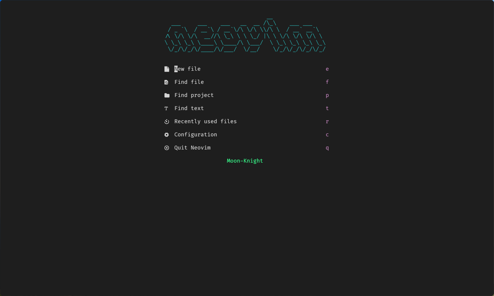
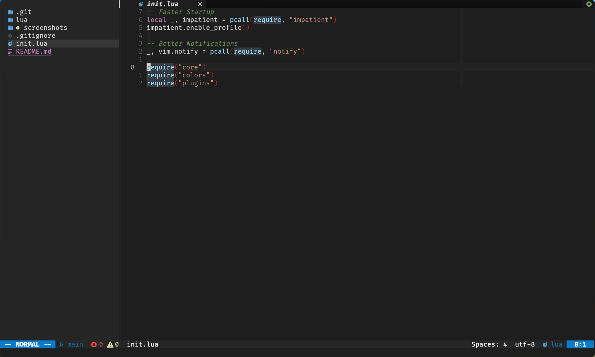
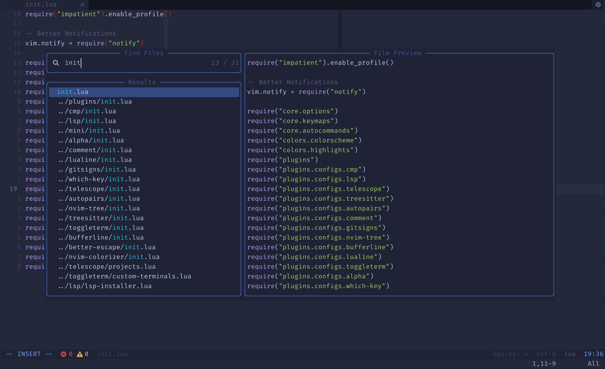

# Moon-Knight
My Neovim Config in [Lua](https://www.lua.org/)

## 🌟 Screenshots




## ⚡ Requirements
* [Nerd Fonts](https://www.nerdfonts.com/font-downloads)
* [Neovim 0.7+](https://github.com/neovim/neovim/releases)
* [bpython](https://www.bpython-interpreter.org/)

## Structure
```
 nvim
├──  lua
│   ├──  colors
│   │   ├──  colorscheme.lua
│   │   ├──  highlights.lua
│   │   └──  init.lua
│   ├──  core
│   │   ├──  autocommands.lua
│   │   ├──  init.lua
│   │   ├──  keymaps.lua
│   │   └──  options.lua
│   └──  plugins
│       ├──  configs
│       │   ├──  alpha
│       │   │   └──  init.lua
│       │   ├──  autopairs
│       │   │   └──  init.lua
│       │   ├──  better-escape
│       │   │   └──  init.lua
│       │   ├──  bufferline
│       │   │   └──  init.lua
│       │   ├──  cmp
│       │   │   └──  init.lua
│       │   ├──  gitsigns
│       │   │   └──  init.lua
│       │   ├──  indent-blankline
│       │   │   └──  init.lua
│       │   ├──  lsp
│       │   │   ├──  settings
│       │   │   │   └──  sumneko_lua.lua
│       │   │   ├──  handlers.lua
│       │   │   ├──  init.lua
│       │   │   ├──  lsp-installer.lua
│       │   │   ├──  lsp-signature.lua
│       │   │   └──  null-ls.lua
│       │   ├──  lualine
│       │   │   └──  init.lua
│       │   ├──  mini
│       │   │   ├──  bufremove.lua
│       │   │   ├──  comment.lua
│       │   │   ├──  init.lua
│       │   │   ├──  surround.lua
│       │   │   └──  trailspace.lua
│       │   ├──  nvim-colorizer
│       │   │   └──  init.lua
│       │   ├──  nvim-gps
│       │   │   └──  init.lua
│       │   ├──  nvim-tree
│       │   │   └──  init.lua
│       │   ├──  tagbar
│       │   │   └──  init.lua
│       │   ├──  telescope
│       │   │   ├──  init.lua
│       │   │   └──  projects.lua
│       │   ├──  toggleterm
│       │   │   ├──  custom-terminals.lua
│       │   │   └──  init.lua
│       │   ├──  treesitter
│       │   │   └──  init.lua
│       │   ├──  which-key
│       │   │   └──  init.lua
│       │   └──  zen-mode
│       │       └──  init.lua
│       └──  init.lua
├──  plugin
│   └──  packer_compiled.lua
├──  screenshots
│   ├──  screenshot_1.png
│   ├──  screenshot_2.png
│   └──  screenshot_3.png
├──  init.lua
└──  README.md
```

## 🛠️ Installation
### Unix
#### Make Backup
```
mv ~/.config/nvim ~/.config/nvimbackup
```

#### Clone Repository
```
git clone https://github.com/mzebin/Moon-Knight.git ~/.config/nvim
nvim +PackerSync
```
