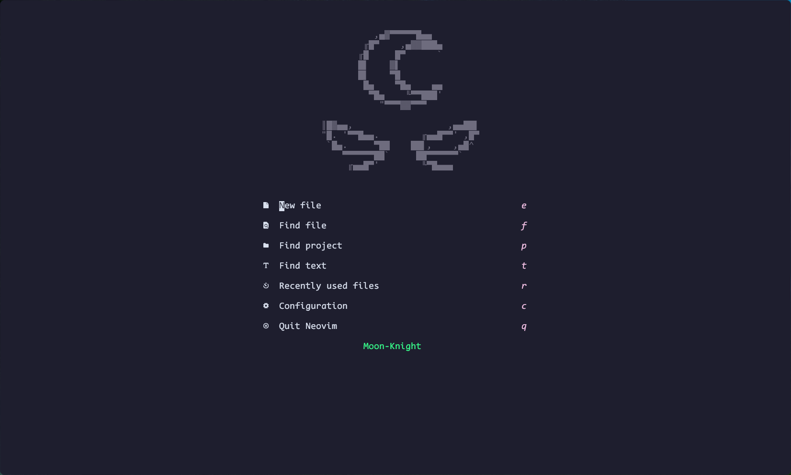

# Moon-Knight
My Neovim Config in [Lua](https://www.lua.org/)

## 🌟 Screenshots



## ⚡ Requirements
* [Nerd Fonts](https://www.nerdfonts.com/font-downloads)
* [Neovim 0.6+](https://github.com/neovim/neovim/releases/tag/v0.6.0)

## 🛠️ Installation
### Unix
#### Make Backup
```
mv ~/.config/nvim ~/.config/nvimbackup
```

#### Clone Repository
```
git clone https://github.com/mzebin/Moon-Knight.git ~/.config/nvim
nvim +PackerSync
```
