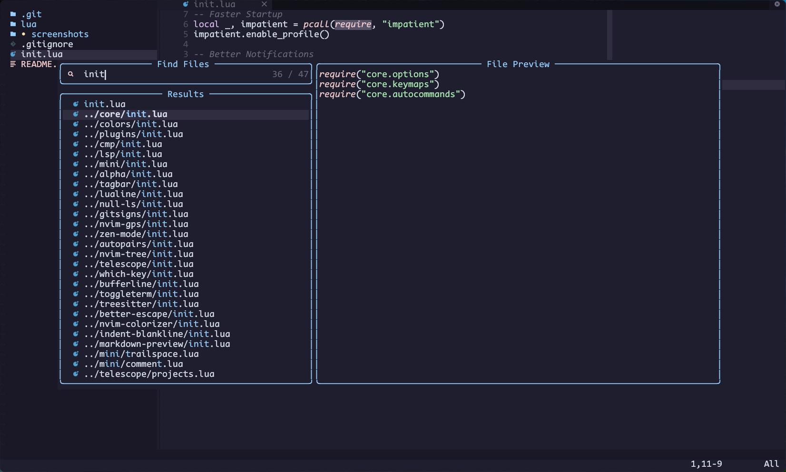

# Moon-Knight
My Neovim Config in [Lua](https://www.lua.org/)

## 🌟 Screenshots




## ⚡ Requirements
* [Nerd Fonts](https://www.nerdfonts.com/font-downloads)
* [Neovim 0.6+](https://github.com/neovim/neovim/releases/tag/v0.6.0)
* [bpython](https://www.bpython-interpreter.org/)

## Structure
```
nvim
├── lua
│   ├── colors
│   │   ├── colorscheme.lua
│   │   ├── highlights.lua
│   │   └── init.lua
│   ├── core
│   │   ├── autocommands.lua
│   │   ├── init.lua
│   │   ├── keymaps.lua
│   │   └── options.lua
│   └── plugins
│       ├── configs
│       │   ├── alpha
│       │   │   └── init.lua
│       │   ├── autopairs
│       │   │   └── init.lua
│       │   ├── better-escape
│       │   │   └── init.lua
│       │   ├── bufferline
│       │   │   └── init.lua
│       │   ├── cmp
│       │   │   └── init.lua
│       │   ├── gitsigns
│       │   │   └── init.lua
│       │   ├── indent-blankline
│       │   │   └── init.lua
│       │   ├── lsp
│       │   │   ├── settings
│       │   │   │   └── sumneko_lua.lua
│       │   │   ├── handlers.lua
│       │   │   ├── init.lua
│       │   │   ├── lsp-installer.lua
│       │   │   ├── lsp-signature.lua
│       │   │   └── null-ls.lua
│       │   ├── lualine
│       │   │   └── init.lua
│       │   ├── mini
│       │   │   ├── bufremove.lua
│       │   │   ├── comment.lua
│       │   │   ├── init.lua
│       │   │   ├── surround.lua
│       │   │   └── trailspace.lua
│       │   ├── nvim-colorizer
│       │   │   └── init.lua
│       │   ├── nvim-tree
│       │   │   └── init.lua
│       │   ├── tagbar
│       │   │   └── init.lua
│       │   ├── telescope
│       │   │   ├── init.lua
│       │   │   └── projects.lua
│       │   ├── toggleterm
│       │   │   ├── custom-terminals.lua
│       │   │   └── init.lua
│       │   ├── treesitter
│       │   │   └── init.lua
│       │   ├── which-key
│       │   │   └── init.lua
│       │   └── zen-mode
│       │       └── init.lua
│       └── init.lua
├── plugin
│   └── packer_compiled.lua
├── screenshots
│   ├── screenshot_1.png
│   ├── screenshot_2.png
│   └── screenshot_3.png
├── init.lua
└── README.md
```

## 🛠️ Installation
### Unix
#### Make Backup
```
mv ~/.config/nvim ~/.config/nvimbackup
```

#### Clone Repository
```
git clone https://github.com/mzebin/Moon-Knight.git ~/.config/nvim
nvim +PackerSync
```
